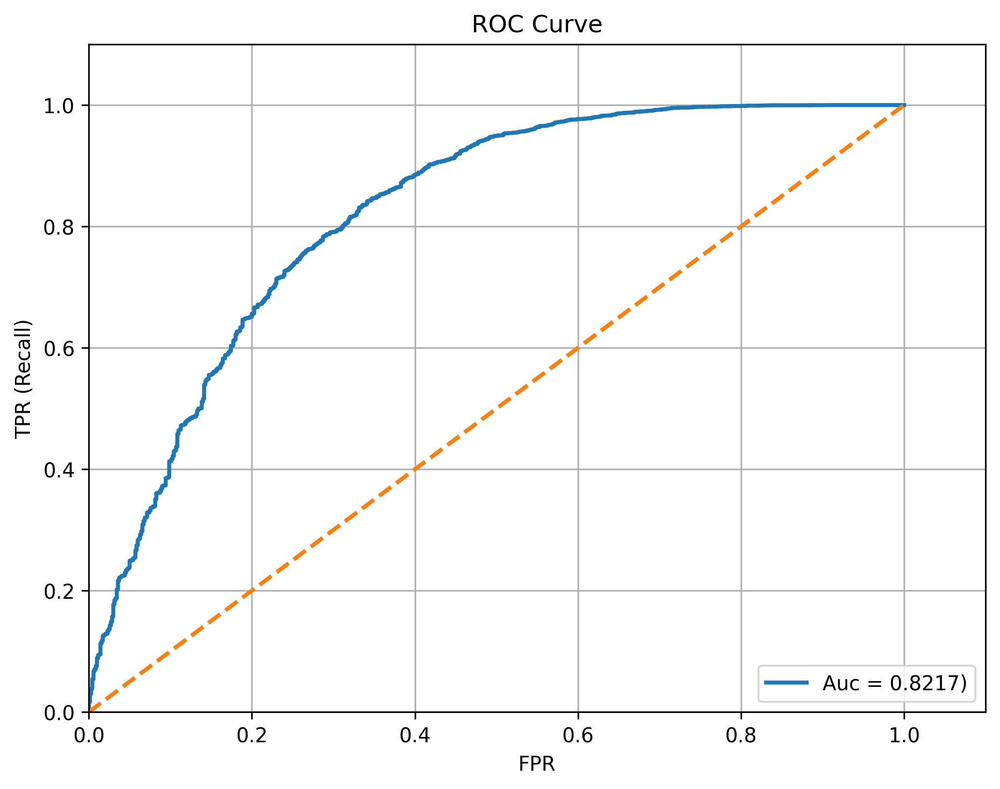
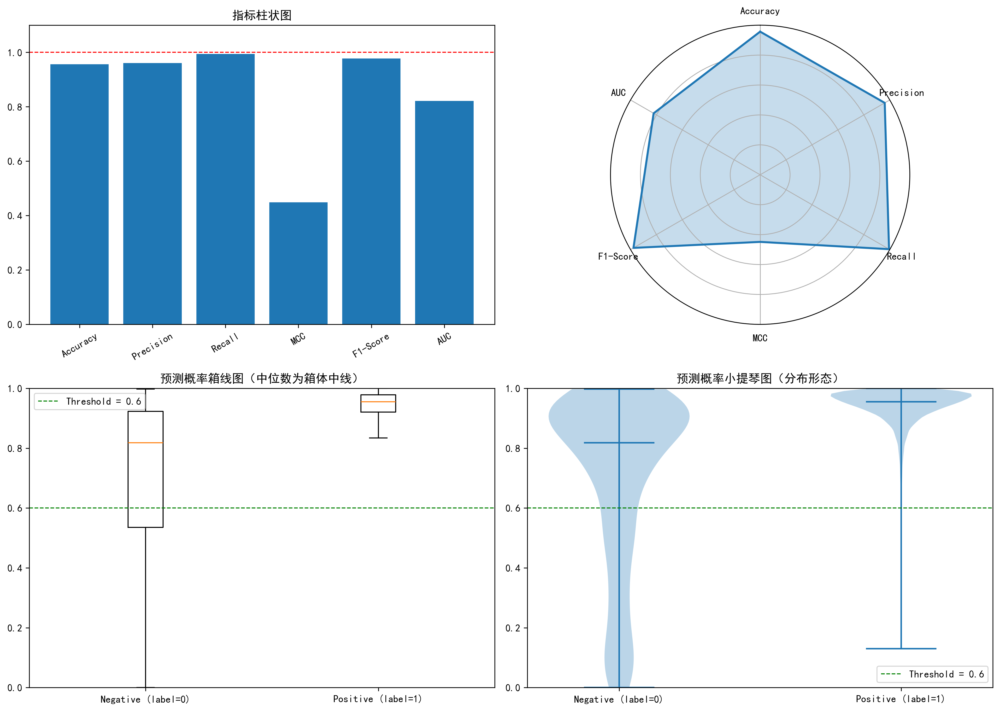

# 🧬 EPI-Predict: Enhancer-Promoter Interaction Prediction

**EPI-Predict** 是基于卷积神经网络 (CNN) 与独热编码 (One-hot Encoding) 的 DNA 序列相互作用预测模型。

---

## 🔬 方法论 (Methodology)

### 特征表征 (Representation)
采用 **One-hot Encoding** 将基因组碱基（A, T, C, G）转换为高维稀疏矩阵，完整保留了序列的原始排列信息。

### 模型架构 (Model Architecture)
构建了双通路 **Deep CNN** (卷积神经网络)：
* **并行编码器**: 分别提取增强子 (Enhancer) 与启动子 (Promoter) 的局部空间特征。
* **特征融合层**: 整合序列特征与物理距离（Distance）信息，通过全连接层输出相互作用概率。

### 预测逻辑与阈值 (Prediction & Threshold)
为了在生物序列分析中获得更高的灵敏度（Recall），本项目在推理阶段将分类阈值设定为 **0.6**。当模型输出概率大于或等于 0.6 时，判定为存在相互作用。

---

## 📊 实验结果 (Model Evaluation)

本项目在 DNA 相互作用测试集上进行了评估。通过将阈值优化至 **0.6**，模型在保持高准确率的同时，表现出极高的召回率（接近 99.5%）。

### 核心指标 (Latest Results)
| 指标 (Metric) | 数值 (Value) | 说明 (Note) |
| :--- | :--- | :--- |
| **Accuracy** | **0.9567** | 整体预测准确率 |
| **Precision** | **0.9611** | 预测为正样本中的真实比例 |
| **Recall** | **0.9944** | 真实正样本被成功检出的比例 |
| **F1-Score** | **0.9775** | 精确率与召回率的调和平均 |
| **ROC-AUC** | **0.8217** | 衡量模型区分正负样本的能力 |
| **MCC** | **0.4486** | 衡量不平衡数据分类质量的核心指标 |

### 混淆矩阵 (Confusion Matrix)
> 测试集样本总数：13062。实验结果显示模型对正样本（Interaction）具有极强的识别捕捉能力。

| 真实 \ 预测 | Negative (0) | Positive (1) |
| :--- | :---: | :---: |
| **Negative** | 203 | 497 |
| **Positive** | 69 | 12293 |

### 结果分析 (Result Analysis)
1. **灵敏度优先**：在 EPI（增强子-启动子相互作用）预测中，漏诊的代价通常高于误报。**0.9944** 的召回率确保了绝大多数潜在的调控关系被成功捕获。
2. **鲁棒性表现**：尽管数据集存在类别不平衡（正样本远多于负样本），但 **0.4486** 的 MCC 值证明模型依然具有稳健的分类能力。

## 📈 数据可视化 (Data Visualization)

### 1. ROC 曲线
通过 ROC 曲线验证模型在不同阈值下的表现。

### 2. 综合指标与概率分布
下图展示了模型在 0.6 阈值（绿色虚线）下的性能轮廓及预测概率的 KDE 分布形态。

### 3. UMAP 维度压缩与特征诊断
利用 **UMAP** 算法将高维特征映射至二维空间，从拓扑分布的角度诊断分类表现。

* **全局叠加分析 (Overlay)**: 将 **FP（红色）** 与 **FN（黄色）** 错误样本强制置顶绘制。
* **分离对比诊断 (Separation)**: 将正确预测样本淡化为背景阴影，高亮显示错误样本的分布。

